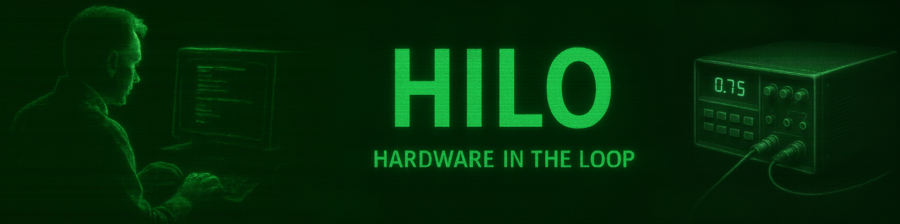

## 1.0 Files

|       Files/Dirs      |                         Description                         |
|-----------------------|-------------------------------------------------------------|
| kicadCustomComponents | The KiCAD libraries for the customized symbols/footprints   |
| IOlinesManagement     | The digital I/O lines interface                             |
| ElectricProtections   | I/O Interface electric protection devices                   |
| MasterControlUnit     | The HILO's brain                                            |

## 2.0 Decription
By the hardware points of view, this HILO is composed by the following separated modules. Everyone of them is connected to
the master one using pin-headers connectors and flat-cables.

- The Master Conroller unit interface the I/O lines with the PC and perform the configured tests
- Digital I/O lines interface
- Output lines electrical protection
- (optional) Dedicated to the Analog lines PCB

## 2.1 Components documentation:
- [APS6404L-3SQR-SN](https://eu.mouser.com/datasheet/3/4815/1/APM_PSRAM_E3_QSPI%20(APS6404L-SQH%20KGD_PKG)%20v4.1.pdf)
- [ESP32 WROOM-32-UE](https://www.espressif.com/sites/default/files/documentation/esp32-wroom-32e_esp32-wroom-32ue_datasheet_en.pdf)
- [ESP32-DevKitC-V4](https://docs.espressif.com/projects/esp-idf/en/release-v4.2/esp32/hw-reference/esp32/get-started-devkitc.html)
- [STM32F407VG](https://www.st.com/resource/en/datasheet/dm00037051.pdf)
- [STM32F407G-DISC1](https://www.st.com/resource/en/data_brief/stm32f4discovery.pdf)

## 2.2 Logic scheme:

