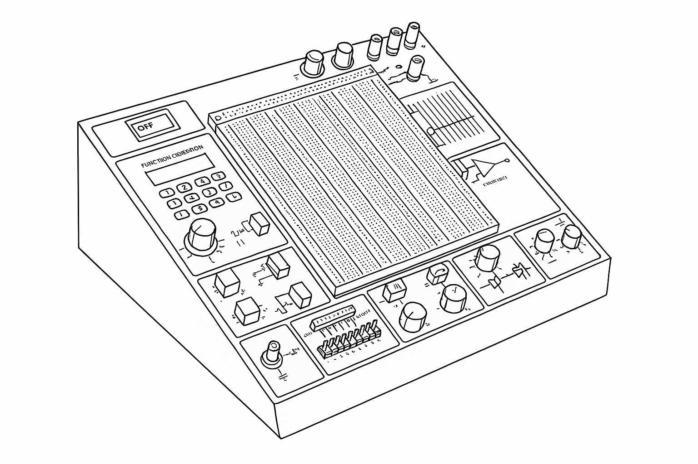

## 1.0 Files

| Files/Dirs | Description                          |
|------------|--------------------------------------|
| firmware   | The firmware for manager MCU         |
| PCB        | All the PCBs used in the project     |
| pcSoftware | The software used to manage the HILO |

## 2.0 Decription
The goal of this project is to get a device that allows the user to test an electronic system in an easy way, also remotely.
In the 1990 when I was studying at high scool, who was developing new devices, used generic boxes with buttons, switches,
LEDs, displays.... installed on it. This device allowed him to emulate the external environment.

It could look like useful for hobbyist, but it is an expensive, big, uncomfortable device, usually. 
For professional using it is not an adequate solution, because td does not allow you to see what happens in very short
time slots. For example, you need to monitor a 8bit bus behaviour after one millisecond after some digital input signal.
In this case, this kind of devices is absolutely unuseful.
Unfortunately, many Italian companies still use the same deplorable methodology, today too! Their test plans do not respect
the [V-model](https://www.sei.cmu.edu/blog/using-v-models-for-testing), and their firmware developers have to work on-site
only.

But the smarter companies use advanced and complicated devices that allow them to test their electronic products remotely,
in deeper and easier way. These tools are very sophisticated and programmable simulator, where they can simulate the
external environment in realistic and reliable way. These tools' class is called 
[**HILO**](https://en.wikipedia.org/wiki/Hardware-in-the-loop_simulation) (Hardware In the LOop).

This project aims to provide a low-cost and very very simple HILO. This one offers less and more limited features,
obviously.
	
#### 2.1 Test mode vs interactive mode
This HILO has two operating modes, that the user can set using the tester client GUI. In the first one (test-mode), the
user can monitor the DUT behavior for output-pins activities that run fast or for a short time periods. In the second one
the user can change the HILO's output-pins, directly, and verifies the DUT's behavior as consequence.

- **Test mode:**
	the user has to create a DUT test-recepit where he has to define the HILO's output-pins values, when they change during
	the test, and the max frequency of the changes. This synchronization will be also used to read the HILO's input-pins.
	Before to start the test, the HILO will convert the pin-status changes definitions in a scheduled output data sequence.
	When this raw-data sequence is ready, a bit configuration will be sent to the output-pins on every chock pulse, and
	the input pins will be read.

- **Interactive mode:**
	In this mode, the user will be able to change the HILO's output-pins values and check for the input ones status, 
	interactively. It is a good way to get an overview on the DUT's behavior, but, because you cannot schedule the
	changes with a precise time, it is not adequate for real-time interactions.

#### 2.2 Functional scheme overview:

@startuml

top to bottom direction
skinparam actorStyle awesome

footer "It has been created with PlantUML"

Actor " User " as USER

cloud "  WiFi Network  " AS WLAN

rectangle "Test client" as TCL

rectangle "HILO device" as HILO

package "DUT" as DUT {
	circle "pin00" as DP00
	circle "pin01" as DP01
	circle "pin02" as DP02
	circle "pin03" as DP03
	circle "pin04" as DP04
	circle "pin05" as DP05
	circle "pin06" as DP06
	circle "pin07" as DP07
	circle "pin08" as DP08
	circle "pin09" as DP09
	circle "pin10" as DP10
	circle "pin11" as DP11
	circle "pin12" as DP12
	circle "pin13" as DP13
	circle "pin14" as DP14
	circle "pin15" as DP15
}

USER <-down-> TCL
TCL  <-down-> WLAN
WLAN <-down-> HILO

HILO -down- DP00
HILO -down- DP01
HILO -down- DP02
HILO -down- DP03
HILO -down- DP04
HILO -down- DP05
HILO -down- DP06
HILO -down- DP07
HILO -down- DP08
HILO -down- DP09
HILO -down- DP10
HILO -down- DP11
HILO -down- DP12
HILO -down- DP13
HILO -down- DP14
HILO -down- DP15

@enduml
