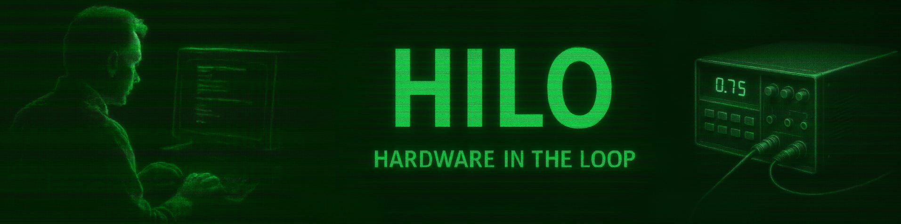

## 1.0 Files

| Files/Dirs           | Description                                         |
|----------------------|-----------------------------------------------------|
| build.pro            | QMake rules to build the whole project files        |
| [conf.pri]           | Building process configuration file                 |
| envVarOverriding.pri | QMake tool to get config data fron environment vars |
| gdbToConfig.pri      | Qmake tool to set debug mode flags                  |
| utils.pri            | QMake general purpose functions library             |
| inputDevs            | Virtual input devices (DUT point of view)           |
| mainApp              | The graphic console application                     |
| outputDevs           | Virtual output devices                              |
| sharedComps          | Graphic components used by the other modules        |

## 2.0 Description
This folder hosts the HILO's GUI. When you use this HILO in interactive mode, this graphical interface will allow you to set your
test environment with many virtual tools (buttons, led-stripes, switches, keypads, displays... and so on) and verify the DUT's
behavior controlling its input and output in all configurations you have planned.

### 2.1 QT
In order to provide a multiplatform and very flexible GUI I have developed this module using the QT framework. In fact, QT allows
me to modify and create new widgets in a very powerful way.

## 3.0 code building
To provide a multiplaform building chain, I have used the official QT's tool **QMake6**. It requires a configuration file
file.pro) to produce the platform dependent build-chain files (eg. Makefile for Unix/Linux). After you obtained those files , you
can compile the code with your usual tool-chain, directly. For example, to performs the described tasks together, if you are using
a POSIX systems, you can run the following command:

	qmake6 *.pro && make all

[!] Use this approach for all sub-modules' tests too.

## 4.0 How to write new I/O virtual devices
