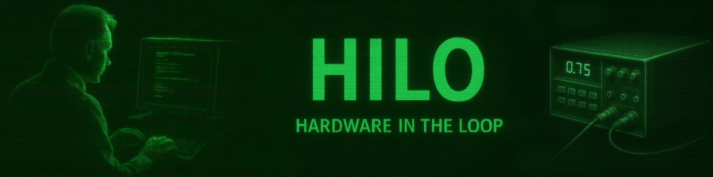

## 1.0 Files

|   **Files and dirs**   | **Description**                                                            |
|------------------------|----------------------------------------------------------------------------|
| build                  |  The rules you need to compile the project                                 |
| Core                   |  The project's source code                                                 |
| Drivers                |  The drivers's source code                                                 |
| HILO_engine.ioc        |                                                                            |
| STM32F031K6TX_FLASH.ld |  The linker script generated by CubeMX                                     |

## 2.0 Description

This component is the one that performs the test, effectively.
Please, read the ../README and ../HILO_interface/README files

### 2.1 Firmware's main steps

0) Hardware initialization
   Subsystems initialization and I2C channel opening in slave-mode
		
1) MCU waiting for a command by the HILO_interface component

2) Scheduled test
   if **HENG_TEST_START** command is received and the test has been previously properly configured, then the MCU starts
   to perform the test and stores the results in the SRAM. While this process is running, the MCU can reply to the
   **HENG_TEST_GETSTATUS** request, sending the number of the last executed step. At the end of the test or if an 
   **HENG_TEST_STOP** message is received, the MCU returns to wait for new commands.
		
3) Interactive test
   Before to perform the test, the MCU has to get an **HENG_RT_SETPINSDIR** message to configure the I/O type of its pins.
   When the **HENG_RT_START** command is received, the MCU reads data from its input pins and returns the data to the
   Hilo_interfaces via SPI.
   The user will be able to change the output pins' values with the **HENG_RT_SETPINSVAL** command, in "realtime".
   The **HENG_RT_STOP** command will force the MCU to returns at the initial state.

### 2.2 SRAM

This external memory is used just in the scheduled-test mode. 
In order to achieve better speed performance, the MCU uses two different memory areas, one just for reading operations the other
just for data writing, and they are also connected with two different SPI ports.
For every test's step, MCU will perform the following steps:

1) The output pins configuration will be read from the first memory area
2) HILO's pins will be set properly
3) The HILO's input pins value will be stored in the second memory area.
4) The internal counter will be incremented

Output-pins' configurations layout
		
| Test step | Bits mask (0=IN)  |   OUT pins value  |
|-----------|-------------------|-------------------|
| **step 1**| XXXXXXXX:XXXXXXXX | XXXXXXXX:XXXXXXXX |
| **step 2**| XXXXXXXX:XXXXXXXX | XXXXXXXX:XXXXXXXX |
| **step 3**| XXXXXXXX:XXXXXXXX | XXXXXXXX:XXXXXXXX |
| **step n**|///////////////////|///////////////////|

Test results (8 Bytes) record: digital and analog input-pins values

| Test step  | Inputs pins | Fuses status | Data from A/D |  Not used  |
+------------+-------------+--------------+---------------+------------+
| **step 0** |   2 bytes   |    2 bytes   |    2 Bytes    |  2 bytes   |
| **step 1** |   2 bytes   |    2 bytes   |    2 Bytes    |  2 bytes   |
| **step 2** |   2 bytes   |    2 bytes   |    2 Bytes    |  2 bytes   |
| **step n** |/////////////|//////////////|///////////////|////////////|

### 2.3 Dynamic I/O configuration

Each test step is encoded using 4 bytes:

- 2 bytes define the I/O direction of the test lines;
- 2 bytes define the values to be generated on the lines configured as outputs.

At first sight, storing the I/O direction for every test step may appear redundant, since in many tests the pin direction does
not change during the whole test sequence.

However, keeping the I/O configuration as part of each test step allows HILO to change the direction of any test line during
test execution. This is required to reproduce the behaviour of bidirectional and half-duplex interfaces.

A particularly relevant example is an open-drain line. In this case, HILO can generate the two logical line states as:

- **LOW:** configure the line as output and drive it low;
- **RELEASED:** configure the line as input, leaving the external pull-up free to drive it high.

Therefore, the I/O direction is not merely a static hardware configuration: it can be considered part of the test stimulus itself.

This flexibility has a cost, since the STM32F407 must potentially update the GPIO configuration at every test step. However, the
target test frequency is in the range of a few hundred kHz. At 500 kHz, for example, a complete test step lasts 2 µs, corresponding
to 336 CPU cycles with the STM32F407 running at 168 MHz.

The worst-case execution time of a test step must therefore satisfy:

`Tstep = TSRAM_read + TGPIO_config + TGPIO_write + TGPIO_read + TSRAM_write + Toverhead < Ttimer`

The actual execution time will be measured during implementation. If the complete operation fits within the required timer period with
sufficient margin, the additional per-step I/O configuration is considered an acceptable cost for the flexibility it provides.

## 3.0 Building procedure
	In order to keep track of every change, in the building rules too, I have chosen to use the usual Makefile building chain
	instead the ST proprietary one. So, in order to build the firmware use make command from the "build" folder inside
